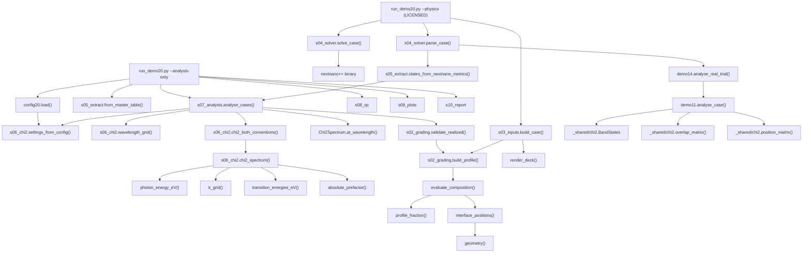

# Demo 20: Complete Mathematical Walkthrough

## Worked example: 1.0 nm linear interface grading (case 04)

> This document explains **the calculation Demo 20 actually performs**, not a
> simplified stand-in. Every equation below is either implemented in the
> repository at the cited `file:line`, is a derivation of one that is, or is
> explicitly labelled **BACKGROUND THEORY — not directly evaluated in Python**.
>
> Every number is real. The subband energies and matrix elements are output of a
> licensed nextnano++ run; the susceptibility values are reproduced here by
> Demo 20's own production functions and verified against the stored result.
>
> Companion files (this directory):
> * `demo20_math_physics_reference.py` — every equation in one file
> * `trace_demo20_linear_1nm.py` — the numbered, runnable trace
> * `trace_linear_1nm/` — checkpoint CSV/JSON written by that trace

---

## 1. What are we calculating?

### Simple explanation

Two GaAs quantum wells of different width (7.1 nm and 2.9 nm) sit next to each
other, separated by a thin 1.8 nm Al₀.₅₅Ga₀.₄₅As barrier they can tunnel
through. The whole thing is buried in more Al₀.₅₅Ga₀.₄₅As.

Because the pair is **asymmetric**, the electron states and the hole states are
not mirror images of each other: the second electron state gets pushed into the
thin well while both hole states stay in the thick well. That lopsidedness is
what lets the structure **double the frequency of light** — take in two 1550 nm
photons, give out one 775 nm photon. A perfectly symmetric structure would give
exactly zero, by parity.

The number we report, χ⁽²⁾ in pm/V, says how strongly it does that.

The question case 04 asks: *if each material interface is smeared over 1 nm
instead of being atomically sharp, what happens to that number?*

### Mathematical / technical explanation

Demo 20 evaluates the interband second-order susceptibility χ⁽²⁾_xzx for
second-harmonic generation, from **Ramesh 2023 Eq. (3)** with Eq. (5) and
Eq. (6) (*Appl. Phys. Lett.* **123**, 251111). As published:

$$
\chi^{(2)}_{xzx}(\omega_1,\omega_2)
= \frac{N_z e^3 r_{e,hh}^2}{6\varepsilon_0\hbar^2}
\sum_{\mathbf{k}_\parallel}\sum_{m,n,l}\big(A - B\big)
$$

Demo 20 evaluates the algebraically equivalent **energy form** — the same
equation with both denominators written in eV rather than rad/s, which absorbs
$\hbar^{-2}$ exactly:

$$
\chi^{(2)}(E) = \underbrace{\frac{N_z e^3 r_{e,hh}^2}{6\varepsilon_0}}_{\text{prefactor}}
\;\sum_i w_i \, S(k_i, E)
$$

$$
S(k,E)=\sum_{m,n,l}\left[
\frac{O_{nm}\,z^{e}_{nl}\,O_{lm}}{\big(\Delta E_{nm}(k)-2E+i\Gamma\big)\big(\Delta E_{lm}(k)-E+i\Gamma\big)}
-
\frac{O_{nm}\,z^{hh}_{ml}\,O_{nl}}{\big(\Delta E_{nm}(k)-2E+i\Gamma\big)\big(\Delta E_{nl}(k)-E+i\Gamma\big)}
\right]
$$

**Source:** `nextnano/demos/20_quantum_well_interface_grading_scaled/s06_chi2.py:1-42`
(the model statement) and `s06_chi2.py:641-661` (the loop that evaluates it).

The reported quantity is $|\chi^{(2)}|$ at a **fundamental** wavelength of
1550 nm.

---

## 2. Complete calculation pipeline

```
[A] case definition        s01_cases.py:142        profile='linear', W=(1,1,1,1) nm
         |
[B] geometry               s02_grading.py:103      I1..I4 = 9.1/16.2/18.0/20.9 nm
         |
[B] grade windows          s02_grading.py:362      [8.6,9.6], [15.7,16.7], ...
         |
[B] grading equation       s02_grading.py:162      x_Al = x_L + (x_R-x_L)·f(u), f(u)=u
         |
[B] x_Al(z)                s02_grading.py:211      601-point composition field
         |
[B] deck rendering         s03_inputs.py:169       case.in with 4 ternary_linear regions
         |
=========== LICENCE BOUNDARY ==============================================
         |
[C] band parameters        nextnano++ database.nnp V_e(z), V_hh(z), m*(z)
         |
[C] eigensolver            nextnano++             H ψ = E ψ  →  E_n, ψ_n(z)
         |
=========== BACK IN PYTHON ================================================
         |
[D] normalization          _shared/chi2.py:157     ψ ← ψ / √(∫ψ² dz)
        |                                          (STEP 08 re-runs this on
        |                                           case 04's own envelopes)
         |
[D] overlap integrals      _shared/chi2.py:204     O_nm = ∫ψ_e,n ψ_hh,m dz
[D] position matrices      _shared/chi2.py:220     z^e_nl, z^hh_ml = ∫ψ z ψ dz
         |
[D] transition energies    s06_chi2.py:537         ΔE_nm(k) = ΔE_nm(0) + ħ²k²/2μ
[D] photon energies        s06_chi2.py:157         E = hc/λ
[D] k grid + weights       s06_chi2.py:346         w_i = g_s k_i dk_i/(2π)
         |
[D] triple sum             s06_chi2.py:646-658     16 terms, S(k,E)
         |
[D] k integration          s06_chi2.py:661         Σ_i w_i S(k_i,E)   (one np.dot)
         |
[D] prefactor + units      s06_chi2.py:514         × 56.698…  →  pm/V
         |
[D] extract at 1550 nm     s06_chi2.py:573         np.interp
         |
    |χ⁽²⁾|(1550 nm) = 18.047520507860781 pm/V
```

Legend: **[A]** your input · **[B]** deterministic Python · **[C]** nextnano++ ·
**[D]** Python nonlinear-optical post-processing.

---

## 3. Initial physical structure

### A. User-defined physical inputs

All from `demo20_config.yaml`, frozen from Demo 19 and not retuned.

| Quantity | Value | YAML key |
|---|---|---|
| thick well | 7.1 nm | `geometry.thick_well_nm` |
| tunnel barrier | 1.8 nm | `geometry.tunnel_barrier_nm` |
| thin well | 2.9 nm | `geometry.thin_well_nm` |
| period barrier | 18.2 nm | `geometry.period_barrier_nm` |
| barrier Al fraction | 0.55 | `materials.barrier_al_fraction` |
| well Al fraction | 0.00 | `materials.well_al_fraction` |
| temperature | 300 K | `materials.temperature_K` |
| mesh (active) | 0.05 nm | `mesh.active_region_grid_spacing_nm` |
| broadening Γ | 5.0 meV | `chi2.broadening_meV` |
| r_e,hh | 0.751 nm | `chi2.r_e_hh_nm` |
| N_z convention | `period_density` | `chi2.nz_mode` |
| states in the sum | 2 per band | `states.max_states_per_band` |
| k∥ cutoff | 0.10 × π/a | `k_parallel.fraction_of_bz` |
| k∥ points | 96 | `k_parallel.points` |
| target wavelength | 1550 nm | `chi2.target_wavelength_nm` |

And the case itself, `s01_cases.py:142`:

```python
GradingCase("04", "Linear 1.0 nm", "linear", (1.0,) * 4, 1.0),
```

`widths_nm` is ordered `(I1, I2, I3, I4)` and each entry is the **full**
0 → 0.55 transition width in nm, centred on that nominal interface.

---

## 4. Interface positions

**File:** `nextnano/demos/20_quantum_well_interface_grading_scaled/s02_grading.py`
**Function:** `geometry` (line 103), `interface_positions` (line 139),
`interface_directions` (line 151)
**Performed by:** Python

### Simple explanation

Stack the layers left to right and write down where each join lands. Half the
18.2 nm period barrier goes on each side so the simulated cell is exactly one
30 nm period.

### Mathematical explanation

$$
\text{outer} = \tfrac{1}{2}\,d_\text{period},\quad
I_1 = \text{outer},\quad
I_2 = I_1 + d_\text{thick},\quad
I_3 = I_2 + d_\text{tunnel},\quad
I_4 = I_3 + d_\text{thin}
$$

```
outer = 18.2/2 = 9.1
I1 = 9.1
I2 = 9.1 + 7.1  = 16.2
I3 = 16.2 + 1.8 = 18.0
I4 = 18.0 + 2.9 = 20.9
domain = 20.9 + 9.1 = 30.0
```

| Interface | z (nm) | x_Al left → right | Physical role |
|---|---|---|---|
| I1 | 9.1 | 0.55 → 0.00 | outer AlGaAs → thick GaAs well |
| I2 | 16.2 | 0.00 → 0.55 | thick well → tunnel AlGaAs |
| I3 | 18.0 | 0.55 → 0.00 | tunnel AlGaAs → thin GaAs well |
| I4 | 20.9 | 0.00 → 0.55 | thin well → outer AlGaAs |

Quantum region: `[7.1, 22.9]` nm (active region ± 2.0 nm padding).

**Grading never moves these positions.** It replaces equal lengths of the two
adjacent materials, keeping both the nominal interface and the total length
fixed (`s01_cases.GEOMETRY_CONVENTION`, line 38).

---

## 5. The 1 nm linear grading function

**File:** `s02_grading.py`
**Function:** `profile_fraction` (line 162), the `key == "linear"` branch
**Performed by:** Python

### Simple explanation

Instead of the Al concentration jumping from 0.55 to 0 at exactly 9.1 nm, it
slides down in a straight line over the 1 nm from 8.6 nm to 9.6 nm. The
interface *centre* does not move; what changes is that the material on either
side gets eaten into by 0.5 nm.

### Mathematical explanation

For a full width $W$ centred on $z_i$:

$$
z_- = z_i - \tfrac{W}{2},\qquad
z_+ = z_i + \tfrac{W}{2},\qquad
u(z) = \mathrm{clip}\!\left(\frac{z - z_-}{W},\,0,\,1\right)
$$

$$
f(u) = u \quad\text{(linear family)},\qquad
x_{\mathrm{Al}}(z) = x_L + (x_R - x_L)\,f(u)
$$

In code, `s02_grading.py:243-250`:

```python
lo, hi = centre - width / 2.0, centre + width / 2.0
mask = (z >= lo) & (z <= hi)
u = np.clip((z[mask] - lo) / width, 0.0, 1.0)
fraction = profile_fraction(u, case.profile, **options)
start_x, end_x = directions[interface_id]
x_al[mask] = start_x + (end_x - start_x) * fraction
```

Symbol → variable:

| Symbol | Meaning | Python | Units |
|---|---|---|---|
| $z$ | growth coordinate | `z[mask]` | nm |
| $z_i$ | interface centre | `centre` | nm |
| $W$ | full transition width | `width` | nm |
| $z_-$, $z_+$ | grade endpoints | `lo`, `hi` | nm |
| $u$ | normalized coordinate | `u` | — |
| $f(u)$ | shape function | `fraction` | — |
| $x_L$, $x_R$ | Al fraction each side | `start_x`, `end_x` | — |

The other four families share the same `profile_fraction`. Case 04 uses **only**
the linear branch:

| family | $f(u)$ |
|---|---|
| `linear` | $u$ |
| `fermi` | $\big(L(u)-L(0)\big)/\big(L(1)-L(0)\big)$, $L(u)=1/(1+e^{-k(u-1/2)})$, $k=10$ |
| `erf` | $\big(\mathrm{erf}(s(u-\tfrac12))-\mathrm{erf}(-\tfrac s2)\big)/\big(\mathrm{erf}(\tfrac s2)-\mathrm{erf}(-\tfrac s2)\big)$, $s=3$ |
| `cosine` | $\tfrac12\big(1-\cos\pi u\big)$ |
| `abrupt` | $0$ for $u<\tfrac12$, else $1$ |

### Worked numbers, interface I1

$z_i = 9.1$, $W = 1.0$, $x_L = 0.55$, $x_R = 0.00$, so $z_- = 8.6$, $z_+ = 9.6$:

| z (nm) | u | f(u) = u | x_Al |
|---:|---:|---:|---:|
| 8.600 | 0.0000 | 0.0000 | 0.550000 |
| 8.750 | 0.1500 | 0.1500 | 0.467500 |
| 8.850 | 0.2500 | 0.2500 | 0.412500 |
| 9.100 | 0.5000 | 0.5000 | 0.275000 |
| 9.350 | 0.7500 | 0.7500 | 0.137500 |
| 9.500 | 0.9000 | 0.9000 | 0.055000 |
| 9.600 | 1.0000 | 1.0000 | 0.000000 |

Grade windows for case 04:

| Interface | window (nm) |
|---|---|
| I1 | [8.6, 9.6] |
| I2 | [15.7, 16.7] |
| I3 | [17.5, 18.5] |
| I4 | [20.4, 21.4] |

Remaining pure-material plateaus (`s02_grading.plateau_lengths_nm`, line 467):

| Region | pure length (nm) |
|---|---|
| left outer barrier | 8.600 |
| thick well | 6.100 |
| **tunnel barrier** | **0.800** |
| thin well | 1.900 |
| right outer barrier | 8.600 |

The tunnel barrier keeps only 0.8 nm of pure Al₀.₅₅Ga₀.₄₅As out of 1.8 nm —
that is why inter-well coupling changes noticeably in this case.

---

## 6. From grading function to x_Al(z)

**File:** `s02_grading.py`
**Function:** `build_profile` (line 312) → `evaluate_composition` (line 211)
**Performed by:** Python

### BEFORE

```
variable : (nothing — a case description)
type     : GradingCase dataclass
value    : profile='linear', widths_nm=(1.0, 1.0, 1.0, 1.0)
```

### OPERATION

`evaluate_composition` builds the field in two passes (lines 231-250):

1. **Abrupt skeleton** — $x_{\mathrm{Al}} = 0.55$ everywhere, then $0$ on the
   closed intervals $[I_1, I_2]$ and $[I_3, I_4]$.
2. **Ramps** — for each interface with $W>0$, overwrite
   $[z_i-\tfrac W2,\,z_i+\tfrac W2]$ with $x_L+(x_R-x_L)f(u)$. Later writes win,
   so the ramps overwrite the well edges laid down in pass 1.

`build_profile` samples that on **two** grids:

| grid | built by | spacing | purpose |
|---|---|---|---|
| `x_nm` | `profile_mesh(continuous=False)` | 0.05 nm + every interface centre and grade endpoint | **this is what the deck encodes** |
| `x_nm_continuous` | `profile_mesh(continuous=True)` | 20× finer | audit only — **never an input** |

### AFTER

```
Variable : profile.x_nm
Type     : numpy.ndarray (float64)
Shape    : (601,)
Units    : nm
First 5  : [0.   0.05 0.1  0.15 0.2 ]
Last 5   : [29.8  29.85 29.9  29.95 30.  ]

Variable : profile.al_fraction
Type     : numpy.ndarray (float64)
Shape    : (601,)
Units    : dimensionless, in [0, 0.55]
First 5  : [0.55 0.55 0.55 0.55 0.55]
Last 5   : [0.55 0.55 0.55 0.55 0.55]
min = 0.000000   max = 0.550000
```

Full array: `trace_linear_1nm/03_grading_profile.csv`.

### Solver-free validation (`s02_grading.validate_realized`, line 386)

| check | result |
|---|---|
| `validation_pass` | True |
| `maximum_composition_error` | **0.000e+00** |
| `gaas_reaches_zero` | True |
| `algaas_reaches_max` | True |
| `unintended_overlap` | False |

The error is exactly zero because `linear` is **native** nextnano++ syntax — no
sampled table is interpolated. For `fermi`/`erf`/`cosine` this number is
nonzero and is what the audit grid exists to measure.

### Why this matters physically

The case description has become an actual spatial material field. **This array
is the only thing about the structure that differs between case 00 (abrupt) and
case 04** — same interfaces, same total length, same materials, same mesh.

---

## 7. From composition to the nextnano model

**File:** `s03_inputs.py`
**Function:** `build_case` (line 207) → `_native_blocks` (line 107) →
`render_deck` (line 169); template `graded_acqw20.in.j2`
**Performed by:** Python

Two rendering paths, chosen by profile family:

| family | representation | nextnano++ does |
|---|---|---|
| `abrupt`, `linear` | **native** `ternary_constant` / `binary` / `ternary_linear` regions | evaluates the ramp exactly |
| `fermi`, `erf`, `cosine` | sampled DAT table + `ternary_import{}` | interpolates **linearly** between rows |

Case 04 is native. `ternary_pyramid` is never emitted, and `render_deck` refuses
a deck that contains it (`s03_inputs.py:202`).

The composition part of the generated deck (verbatim, `demo_results/demo20/inputs/case_04/case.in`):

```text
    region{ everywhere{}
        ternary_constant{ name = "Al(x)Ga(1-x)As"  alloy_x = 0.550000 } }
    region{ line{ x = [9.100000, 16.200000] }   binary{ name = "GaAs" } }
    region{ line{ x = [18.000000, 20.900000] }  binary{ name = "GaAs" } }
    region{ line{ x = [8.600000, 9.600000] }
        ternary_linear{ name = "Al(x)Ga(1-x)As"  alloy_x = [0.550000, 0.000000]  x = [8.600000, 9.600000] } }
    region{ line{ x = [15.700000, 16.700000] }
        ternary_linear{ name = "Al(x)Ga(1-x)As"  alloy_x = [0.000000, 0.550000]  x = [15.700000, 16.700000] } }
    region{ line{ x = [17.500000, 18.500000] }
        ternary_linear{ name = "Al(x)Ga(1-x)As"  alloy_x = [0.550000, 0.000000]  x = [17.500000, 18.500000] } }
    region{ line{ x = [20.400000, 21.400000] }
        ternary_linear{ name = "Al(x)Ga(1-x)As"  alloy_x = [0.000000, 0.550000]  x = [20.400000, 21.400000] } }
```

The four `alloy_x = [...]` pairs are exactly the $(x_L, x_R)$ of §4, and the
four `x = [...]` spans are exactly the grade windows of §5.

> **Coordinate naming:** nextnano++ calls the growth axis `x`. The
> susceptibility notation and every plot call the same axis `z`. They are the
> same axis.

### INPUT TO NEXTNANO++ (complete)

```text
global{      simulate1D, temperature = 300.0, substrate GaAs,
             crystal_zb x_hkl=[1,0,0] y_hkl=[0,1,0] }
contacts{    fermi qw_contact, bias = 0.0 }
grid{        control lines: 0.0 @ 0.5 nm, 9.1 @ 0.05 nm,
                            20.9 @ 0.05 nm, 30.0 @ 0.5 nm }
structure{   the seven regions above; output_alloy_composition }
classical{   Gamma, HH, LH, SO; output_bandedges, output_bandgap }
quantum{ region{
             name = "acqw", x = [7.1, 22.9]
             no_density = yes
             boundary{ x = dirichlet }
             Gamma{ num_ev = 6 }   HH{ num_ev = 6 }
             output_states{ max_num = 6  envelopes = yes  probabilities = yes }
             transition_energies{ Gamma_HH{} }
             overlap_integrals{ Gamma_HH{} }
             dipole_moment_matrix_elements{
                 polarization{ name = "growth_z"  re = [1,0,0] }
                 Gamma{}  HH{} } } }
run{ quantum{} }
```

**NOT in the deck: any band parameter.** No effective mass, no band gap, no
band offset, no bowing coefficient, no deformation potential. nextnano++ looks
every one of those up in its proprietary `database.nnp`, keyed on the material
name and the local `x_Al(z)`. Those numbers are not visible in this repository.

---

## 8. What nextnano solves

**Performed by:** nextnano++ — a **black box** from Python's point of view.
Invoked by `s04_solver.solve_case` (`s04_solver.py:191`), which shells out
through `solver14.execute_real`.

### BACKGROUND THEORY — not directly evaluated in Python

**Step 1: alloy → potential.** At every mesh point, look up the AlGaAs band
parameters at the local $x_{\mathrm{Al}}(z)$ and form the Γ-conduction and
heavy-hole band edges

$$
V_e(z) = E_c\big(x_{\mathrm{Al}}(z)\big),\qquad
V_{hh}(z) = E_{v,HH}\big(x_{\mathrm{Al}}(z)\big)
$$

with alloy bowing, the 300 K Varshni shift and the band offset all supplied by
`database.nnp`. Demo 20 never forms $V_e$ or $V_{hh}$ and never sees them except
as the `bandedges` output file the Demo 11 parser reads for QC.

**Step 2: the envelope-function eigenproblem**, one band at a time, on the
quantum region $[7.1, 22.9]$ nm with Dirichlet walls $\psi(7.1)=\psi(22.9)=0$:

$$
\left[-\frac{\hbar^2}{2}\frac{d}{dz}\!\left(\frac{1}{m^*(z)}\frac{d}{dz}\right) + V(z)\right]\psi_n(z) = E_n\,\psi_n(z)
$$

The $1/m^*(z)$ sandwiched **between** the derivatives is the BenDaniel–Duke
ordering, which keeps the operator Hermitian when the effective mass varies with
position. With 1 nm of graded alloy at every interface, $m^*(z)$ genuinely does
vary there — which is one of the ways grading changes the answer.

`num_ev = 6` asks for the six lowest Γ states and the six highest-electron-scale
HH states. `no_density = yes` means **no Poisson loop runs**: $V(z)$ is the bare
heterostructure potential with no self-consistent electrostatics.
`run{ quantum{} }` triggers exactly that solve and nothing else.

### Summary

```text
INPUT TO NEXTNANO:
    case.in   (geometry, x_Al(z) as ternary regions, T, state counts,
               quantum region, Dirichlet boundary, output requests)
    database.nnp   (proprietary material parameters — not in this repo)
    License_nnp.lic

CALCULATED BY NEXTNANO:
    band edges E_c(z), E_HH(z), E_LH(z), E_SO(z)
    the position-dependent effective mass m*(z)
    6 Gamma eigenvalues + envelopes,  6 HH eigenvalues + envelopes
    state probabilities; its own transition energies, overlap integrals
    and dipole matrix elements (requested for cross-check)

RETURNED TO PYTHON:
    E_e1, E_e2, ... (energy spectrum tables)          [eV]
    psi_e1(z), psi_e2(z), psi_hh1(z), psi_hh2(z)      [solver grid]
    realized x_Al(z), band edges, probabilities, solver log
```

> **On this execution.** The home laptop has no nextnano++ licence, so no solve
> ran while producing this document. The states used below are **real licensed
> solver output for this exact case**, read back from the Demo 19 results table
> (§9). Nothing is simulated, mocked or approximated in their place.

---

## 9. nextnano outputs

**Home path (used here):** `s05_extract.from_master_table` (`s05_extract.py:111`)
reads `E1_eV`, `E2_eV`, `HH1_eV`, `HH2_eV`, `O11..O22`, `z_e11..z_e22`,
`z_hh11..z_hh22` from
`demo_results/demo19/tables/demo19_master_results.csv`. It **re-reads; it never
recomputes**.

**Licensed path (how those columns were produced):**

```
s04_solver.parse_case                       s04_solver.py:272
  └─ demo14.analyse_real_trial              demo14.py:852
      └─ demo11.analyse_case                demo11.py:431
          ├─ quantum1d.parse_one_band_run   electron E and psi
          ├─ demo11._hole_states            demo11.py:246   HH E and psi
          ├─ chi2.BandStates(...)           _shared/chi2.py:134  normalize
          ├─ chi2.overlap_matrix            _shared/chi2.py:204
          ├─ chi2.position_matrix           _shared/chi2.py:220
          └─ writes matrix_elements.json    demo11.py:803
```

### Case 04 energies (real licensed values)

| Symbol | Value (eV) |
|---|---|
| $E_{e1}$ | 2.941158138088 |
| $E_{e2}$ | 3.061022858158 |
| $E_{hh1}$ | 1.447805442384 |
| $E_{hh2}$ | 1.412791422186 |

$E_{e2}-E_{e1} = 0.119864720070$ eV (conduction intersubband)
$E_{hh1}-E_{hh2} = 0.035014020198$ eV (valence intersubband)

### Status flags — keep these separate

| Flag | Value |
|---|---|
| `solver_pass` | **True** — the nextnano++ process exited 0 and wrote its outputs |
| `physical_valid` | **False** — inherited Demo 11/14 physical QC did not pass |
| `failure_reason` | "Demo 11/14 physical QC did not pass" |

This is true for **all 13** Demo 19 cases. The specific failing sub-check cannot
be identified from this checkout — it needs the raw licensed run tree and the
proprietary `database.nnp`. Treat these numbers as a **controlled comparison
between grading cases**, not as validated absolute physics.

---

## 10. Understanding e1, e2, hh1, hh2

### Simple explanation

```
e1  = the lowest energy level an electron can sit in
e2  = the next one up
hh1 = the most tightly bound heavy-hole level
hh2 = the next one
```

Each one is a **state**: an energy *and* a shape (where in the structure that
particle actually is).

### Technical explanation

Each is an eigenpair $(E_n, \psi_n(z))$ of the §8 Hamiltonian. Two conventions
matter:

1. **Single energy scale.** Energies are on nextnano's single *electron* energy
   scale, so an interband transition energy is a plain subtraction
   $E_e - E_{hh}$, with **no band gap added by hand** anywhere in Demo 20.
2. **Hole ordering.** nextnano++ lists hole states with *decreasing*
   electron-scale energy, so index order **is** confinement order: hh1 is the
   most confined hole, not the highest number. That order is preserved and never
   re-sorted (`demo11.py:246-254`).

Demo 20 requests 6 states per band but the sum uses only the first **2** of each
(`states.max_states_per_band = 2`, enforced by `CaseStates.truncated`,
`s06_chi2.py:490`). With 2 states per band the triple sum has
$2\times2\times2 = 8$ conduction terms and 8 valence terms — 16 in all.

---

## 11. Processing the wavefunctions

**Performed by:** Python (post-processing of nextnano++ output)

```
psi_n(z) as nextnano++ writes it
    ↓ NORMALIZATION — YES, Python does this      _shared/chi2.py:155-162
psi_n / sqrt( ∫ psi_n² dz )
    ↓ INTERPOLATION — NO, there is none          demo11.py:467-473
(same grid required; a mismatch raises)
    ↓ ORTHONORMALITY — checked, not enforced     _shared/chi2.py:188
max |<psi_i|psi_j> − δ_ij| ≤ 1e-3
    ↓ multiply two envelopes (× z, optionally), integrate
O_nm, z^e_nl, z^hh_ml
```

### Normalization — yes

$$
N = \int |\psi(z)|^2\,dz \;\approx\; \mathrm{trapezoid}(\psi^2, z),
\qquad \psi \leftarrow \psi/\sqrt{N}
$$

so $\int|\psi|^2dz = 1$ with $z$ in nm, i.e. $\psi$ carries nm$^{-1/2}$.
nextnano++'s envelope output is **not assumed** to be normalized on this grid;
the normalization is re-imposed in Python before any matrix element is formed
(`_shared/chi2.py:155-162`).

### Interpolation — no

There is none. `demo11.analyse_case` (`demo11.py:467-473`) *requires* the
electron and heavy-hole envelopes to already be on the identical grid and raises
`"electron and heavy-hole envelopes are on different grids; the overlap
integrals of Eq. 2 would be meaningless."` otherwise. No resampling, no
common-grid projection, no spline.

### Orthonormality — checked, not enforced

`BandStates.orthonormality_error` (`_shared/chi2.py:188`) computes
$\max_{i,j}|\langle\psi_i|\psi_j\rangle - \delta_{ij}|$ and Demo 11 gates on it
at $10^{-3}$.

**Why this is not housekeeping:** Eq. (5) and Eq. (6) contain **diagonal**
position elements $\langle\psi_i|z|\psi_i\rangle$, and each of those depends on
where you put $z=0$. The origin dependence cancels between the electron and hole
terms — *but only if the within-band basis is orthonormal.* With a
non-orthogonal basis, χ⁽²⁾ would depend on an arbitrary coordinate choice and be
meaningless. Demo 11 additionally runs an explicit origin-shift test
(`demo11.py:606`, 100 nm shift, 1e-6 relative tolerance).

### Where case 04's envelopes come from

```text
Source: Demo 20 Case 04 licensed envelopes
    demo_results/demo20/data/case_04/optical/parsed/envelopes.csv
    demo_results/demo20/data/case_04/optical/parsed/matrix_elements.json
```

Both are written by a licensed `run_demo20.py --physics` run and both are
resolved against `REPO_ROOT`, never as an absolute machine path, so STEP 08
behaves identically on the home and the work laptop
(`trace_demo20_linear_1nm.py:82`, `CASE04_PARSED`).

`envelopes.csv` carries all six states per band the deck requested:

```text
z_nm, psi_e1 … psi_e6, psi_hh1 … psi_hh6      13 columns
```

The susceptibility uses two states per band, so STEP 08 selects exactly

```text
z_nm, psi_e1, psi_e2, psi_hh1, psi_hh2
```

**by header name, not by position** (`trace_demo20_linear_1nm.py`,
`ENVELOPE_COLUMNS` / `_read_envelope_table`). The column *order* of a parser
output is not a contract; the column *names* are. A table missing any of the
five raises rather than silently mis-slicing, and a reordered header produces
identical arrays — both are pinned by tests.

`matrix_elements.json` records the matrices over all six parsed states, so the
comparison uses the leading 2×2 block. That is exact, not an approximation:
each entry is an independent integral of two envelopes, so truncating the
matrix and truncating the basis give the same numbers.

### What STEP 08 does with them

This is the one place where the whole envelope → matrix-element step is
executed in front of you, on **this case's own wavefunctions**:

```text
1  load envelopes.csv, selecting the five columns by name
2  record the raw arrays as stored          (shape, max|ψ|, first values)
3  build the production _shared/chi2.BandStates
4  which normalizes every envelope on construction
5  report ∫|ψ|² dz BEFORE and AFTER, for all four states
6  report orthonormality error for both bands
7  recompute overlap_matrix(band_e, band_hh)      →  O     (2×2)
8  recompute position_matrix(band_e)              →  z^e   (2×2)
9  recompute position_matrix(band_hh)             →  z^hh  (2×2)
10 load the recorded matrix_elements.json
11 compare all 12 elements one at a time
12 assert each |difference| ≤ 1e-12 · max(1, |stored|)
```

and writes `trace_linear_1nm/06_case04_envelopes.csv` with

```text
z_nm,
psi_e1_raw, psi_e2_raw, psi_hh1_raw, psi_hh2_raw,
psi_e1_normalized, psi_e2_normalized, psi_hh1_normalized, psi_hh2_normalized,
psi_e1_times_psi_hh1,        ← the integrand of O11  (§12)
psi_e1_z_psi_e1              ← the integrand of z^e11 (§13)
```

Those last two columns are the point: integrate the first over z and you get
`O11`; integrate the second and you get `z^e_11`. §12 and §13 are then not
descriptions of how case 04's matrix elements were produced — they are a
*re-run* of it, landing on the numbers the licensed run recorded.

> **Reading the "before" column.** `envelopes.csv` is written from the
> already-normalized `BandStates` (`demo11.py:791-801`), so ∫|ψ|² dz is already
> 1 to ~1e-16 before STEP 08 touches it, and re-normalizing is idempotent. That
> is not a redundant check: it is what confirms this file *is* the orthonormal
> basis the recorded matrix elements were built from, rather than an
> unnormalized dump.

> **If the parsed run is not in your checkout.** `demo_results/demo20/data/`
> carries the per-case spectra by default; the `case_04/optical/parsed/` subtree
> only exists where a licensed `--physics` run wrote it. When it is absent STEP
> 08 says so explicitly, then falls back to the one other real licensed envelope
> table in the repository — Demo 11's `s1_ref`, **a different structure**,
> clearly labelled as a fallback and used nowhere else — so the mechanism can
> still be watched working on genuine wavefunctions. Nothing downstream is
> affected either way: §12 and §13 take O, z^e and z^hh from the results table,
> and the χ⁽²⁾ of §23 is identical in both cases. The trace never invents an
> envelope.

---

## 12. Envelope overlap integrals

| Field | Value |
|---|---|
| **Symbol** | $O_{nm}$ |
| **Physical meaning** | how much electron envelope $n$ and hole envelope $m$ look alike — the interband transition strength, envelope part |
| **Equation** | $O_{nm} = \langle\psi_{e,n}\vert\psi_{hh,m}\rangle = \int \psi_{e,n}(z)\,\psi_{hh,m}(z)\,dz$ |
| **States involved** | one electron state × one hole state (**different bands**) |
| **Python function** | `_shared/chi2.overlap_matrix` (`_shared/chi2.py:204`) |
| **Input arrays** | `a.envelopes[:, i]`, `b.envelopes[:, j]`, `a.z_nm` — all `(n_points,)` |
| **Output** | `(2, 2)` float array |
| **Units** | **dimensionless** (ψ is nm$^{-1/2}$ each, dz is nm) |

### Numerical integration

**Continuous:**

$$I = \int \psi_a(z)\,\psi_b(z)\,dz$$

**Discrete — what `np.trapezoid` actually computes:**

$$I \approx \sum_i \tfrac12\big[g(z_i)+g(z_{i+1})\big]\,(z_{i+1}-z_i),\qquad g=\psi_a\psi_b$$

That is the composite trapezoidal rule. `np.trapezoid` does **not** assume a
uniform grid — it uses the actual spacings of `z_nm`, which matters because the
solver mesh is fine in the active region and coarse outside it.

> *numpy note:* this repository runs numpy 2.x, where `np.trapz` was removed;
> the shared module uses `np.trapezoid`.

### Value for case 04 (1.0 nm linear)

|  | m = hh1 | m = hh2 |
|---|---:|---:|
| **n = e1** | 0.9822755287674644 | 0.0154033281220894 |
| **n = e2** | −0.0835300408392951 | 0.3831404861807044 |

$O_{11}=0.982$: e1 and hh1 sit almost exactly on top of each other, so that
interband transition is strong. $O_{22}=0.383$ is much weaker — e2 has been
pushed into the thin well while hh2 has not.

**These four numbers are re-derived, not just quoted.** STEP 08 loads case 04's
own `psi_e1, psi_e2, psi_hh1, psi_hh2`, normalizes them, runs
`_shared/chi2.overlap_matrix` on them and checks all four entries against the
`matrix_elements.json` the licensed run recorded — asserting agreement to
`1e-12 · max(1, |stored|)`. The integrand of $O_{11}$ is column
`psi_e1_times_psi_hh1` of `trace_linear_1nm/06_case04_envelopes.csv`; integrate
it over `z_nm` by the trapezoidal rule above and you land on 0.9822755…

### This is *not* nextnano's own `overlap_integrals` output

The deck does request `overlap_integrals{ Gamma_HH{} }` (§7), but χ⁽²⁾ does not
use it. Demo 20 recomputes the overlaps in Python from the envelopes so the
normalization convention and the quadrature rule stay under its own control and
identical across Demos 11, 12, 13, 14, 19 and 20. The nextnano output is kept
for cross-checking.

---

## 13. Position matrix elements

| Field | Value |
|---|---|
| **Symbols** | $z^{e}_{nl}$, $z^{hh}_{ml}$ |
| **Physical meaning** | diagonal = where a state sits (centroid); off-diagonal = the intersubband transition dipole, divided by $e$ |
| **Equation** | $z^{e}_{nl} = \langle\psi_{e,n}\vert z\vert\psi_{e,l}\rangle = \int \psi_{e,n}\,z\,\psi_{e,l}\,dz$ |
| **States involved** | two states of the **same** band |
| **Python function** | `_shared/chi2.position_matrix` (`_shared/chi2.py:220`) |
| **Input arrays** | `band.envelopes[:, i]`, `band.z_nm`, `band.envelopes[:, j]` |
| **Output** | `(2, 2)` per band |
| **Units** | **nm** |

Discrete form: `np.trapezoid(psi_i * z_nm * psi_j, z_nm)` — the same
trapezoidal rule as §12 with an extra factor of $z$ in the integrand.

### Values for case 04

$z^{e}$ (nm):

|  | l = e1 | l = e2 |
|---|---:|---:|
| **n = e1** | 12.724527319464660 | 1.025173584780866 |
| **n = e2** | 1.025173584780866 | 18.661190322705767 |

$z^{hh}$ (nm):

|  | l = hh1 | l = hh2 |
|---|---:|---:|
| **m = hh1** | 12.651392334244120 | 1.432368406511446 |
| **m = hh2** | 1.432368406511446 | 12.730145536017770 |

**Re-derived in STEP 08 as well.** Both matrices come back out of case 04's
own envelopes through `_shared/chi2.position_matrix`, and all eight entries are
compared element by element against the recorded `matrix_elements.json`. The
integrand of $z^{e}_{11}$ is column `psi_e1_z_psi_e1` of
`trace_linear_1nm/06_case04_envelopes.csv`; its trapezoidal integral is the
12.7245… nm below.

### Read the diagonals — this is the whole physics

```
e1  at 12.72 nm   inside the thick well (9.1 – 16.2 nm)
e2  at 18.66 nm   inside the thin well  (18.0 – 20.9 nm)
hh1 at 12.65 nm   thick well
hh2 at 12.73 nm   thick well

Δz_e  = z^e_22  − z^e_11  = 5.9367 nm
Δz_hh = z^hh_22 − z^hh_11 = 0.0788 nm
```

The two electron states are ~6 nm apart; the two hole states are 0.08 nm apart.
**The electron ladder is spatially separated and the hole ladder is not.** That
asymmetry is what χ⁽²⁾ measures, and it is why the conduction and valence terms
of the sum do not cancel completely (§18).

---

## 14. Bulk interband / Bloch dipole quantity (DFT)

**This is the only DFT-derived number in Demo 20, and it is a single scalar.**

| Field | Value |
|---|---|
| **Symbol** | $r_{e,hh}$ |
| **Value** | 7.51 Å = **0.751 nm** |
| **What it is** | the **bulk GaAs interband Bloch position matrix element** $\langle u_e\vert z\vert u_{hh}\rangle$ between the cell-periodic parts of the conduction and heavy-hole Bloch functions at Γ |
| **Source** | Ramesh 2023, DFT with VASP / HSE06 hybrid functional. Verified verbatim from the PDF: `docs/demo14_physics_sources.md:62` |
| **Where it enters Demo 20** | `s06_chi2.absolute_prefactor`, `s06_chi2.py:514` (line 528: `r_m = r_e_hh_nm * 1e-9`) |
| **Config key** | `demo20_config.yaml:97  chi2.r_e_hh_nm` |

It is a **position**, not a dipole. Eq. (3) already carries $e^3$, so $r$ must
never be multiplied by charge again.

### What DFT did *not* calculate

Everything else. The subband energies, the envelopes $\psi_n(z)$, the overlaps
$O_{nm}$ and the envelope position matrices $z^e$, $z^{hh}$ are all nextnano++
output plus Python post-processing. DFT contributed exactly one number.

### How the three sources combine

The envelope-function approximation factorizes the full interband dipole into a
bulk Bloch part and an envelope part:

$$
\langle e,n\,\vert\, z\,\vert\, hh,m\rangle
\;\approx\;
\underbrace{r_{e,hh}}_{\text{DFT, bulk}}\;\times\;\underbrace{\langle\psi_{e,n}\vert\psi_{hh,m}\rangle}_{\text{nextnano envelopes}}
$$

Eq. (3) contains two such dipoles, so $r_{e,hh}$ comes out of the sum **squared**
and sits in the prefactor, while the envelope overlaps $O_{nm}$ stay **inside**
the sum where they differ term by term:

$$
\chi^{(2)} = \underbrace{\frac{N_z e^3 r_{e,hh}^2}{6\varepsilon_0}}_{\text{DFT + constants}}
\sum_k\sum_{m,n,l}\underbrace{\big\{O\,z\,O - O\,z\,O\big\}}_{\text{nextnano + Python}}
$$

### Three distinct matrix-element species — never merge them

| Symbol | Bands | Object | Units | Computed by |
|---|---|---|---|---|
| $O_{nm}$ | e ↔ hh | envelope overlap | — | Python (§12) |
| $z^{e}_{nl}$, $z^{hh}_{ml}$ | within one band | envelope position | nm | Python (§13) |
| $r_{e,hh}$ | e ↔ hh | **bulk Bloch cell part** | nm | DFT (external) |

---

## 15. Transition energies

**File:** `s06_chi2.py` · **Function:** `transition_energies_eV` (line 537) ·
**Performed by:** Python

### At k = 0

$$\Delta E_{nm}(0) = E_{e,n} - E_{hh,m}$$

A plain subtraction — possible only because nextnano puts electrons and holes on
one energy scale.

| Transition | ΔE (eV) | hc/ΔE (nm) |
|---|---:|---:|
| e1–hh1 | 1.4933526957039998 | 830.24 |
| e1–hh2 | 1.5283667159019998 | 811.22 |
| e2–hh1 | 1.6132174157740000 | 768.55 |
| e2–hh2 | 1.6482314359720000 | 752.23 |

### Dispersion with in-plane k

$$
\Delta E_{nm}(k) = \big(E_{e,n}-E_{hh,m}\big) + \frac{\hbar^2 k^2}{2\mu},
\qquad
\frac{1}{\mu} = \frac{1}{m_e} + \frac{1}{m_{hh,\parallel}}
$$

with $m_e = 0.067\,m_0$ and $m_{hh,\parallel} = 0.112\,m_0$, giving

$$\mu = 0.0419217877094972\,m_0 = 3.8188164969863697\times10^{-32}\ \text{kg}$$

In code (`s06_chi2.py:550-556`), $k$ is converted nm⁻¹ → m⁻¹ (×10⁹) and the
kinetic term J → eV (÷ e).

```
Variable : transitions
Shape    : (2, 2, 96)      # (n_e, n_hh, n_k)
Units    : eV

ΔE_11(k):  k = 0.000000 nm⁻¹  →  1.493352696 eV
           k = 0.140391 nm⁻¹  →  1.511265426 eV
           k = 0.280782 nm⁻¹  →  1.565003615 eV
           k = 0.555714 nm⁻¹  →  1.774016563 eV
total blue shift across the grid = 0.280663867 eV
```

That shift is ~56× the 5 meV broadening, so the k integral genuinely samples a
wide band of detunings rather than smearing the k = 0 answer over a linewidth.

> **Modelling point:** only the **denominators** move with $k$. The envelope
> matrix elements $O$, $z^e$, $z^{hh}$ are treated as **k-independent**. That is
> an approximation of this model, applied identically in Demo 19 and Demo 20.

Full array: `trace_linear_1nm/10_transition_energies_vs_k.csv`.

---

## 16. Photon wavelength and photon energy

**File:** `s06_chi2.py` · **Functions:** `wavelength_grid` (line 604),
`photon_energy_eV` (line 157) · **Performed by:** Python

$$E_\gamma[\text{eV}] = \frac{hc}{\lambda} = \frac{1239.841984}{\lambda[\text{nm}]}$$

`HC_EV_NM = 1239.841984` (`s06_chi2.py:119`).

```
grid = linspace(1400, 1800, 401)      →  spacing exactly 1.0 nm
```

At the target:

| Quantity | Value |
|---|---|
| λ | 1550 nm |
| $E$ | 0.7998980541935483 eV |
| $2E$ | 1.5997961083870966 eV |

### Why changing λ changes χ⁽²⁾ although the structure does not

The structure is frozen across the whole sweep: the same four energies, the same
four matrix elements. **Only the photon energy moves.** The spectrum's shape
comes entirely from how the fixed transition energies of §15 line up against the
moving $E$ and $2E$, through the denominators of §18.

Note where $2E = 1.5998$ eV sits relative to §15: between $\Delta E_{12}=1.5284$
and $\Delta E_{21}=1.6132$ eV. The SHG two-photon resonance is **in among** the
transitions, which is why $|\chi^{(2)}|$ is large near 1550 nm and peaks at
1502 nm.

---

## 17. Building the χ⁽²⁾ numerator

**File:** `s06_chi2.py:649` and `:655` · **Performed by:** Python

```python
numerator = overlap[n, m] * z_e[n, l] * overlap[l, m]     # conduction
numerator = overlap[n, m] * z_h[m, l] * overlap[n, l]     # valence
```

$$
\text{conduction: } O_{nm}\,z^{e}_{nl}\,O_{lm}
\qquad
\text{valence: } O_{nm}\,z^{hh}_{ml}\,O_{nl}
$$

Read as a physical pathway: *create* an e–h pair (one $O$), *move* the carrier
within its own band (the $z$), then *annihilate* the pair (the other $O$).

**Index meaning — the easiest thing to misread:**

| index | is |
|---|---|
| $m$ | the heavy-hole state of the pair |
| $n$ | the electron state of the pair |
| $l$ | the intermediate partner — an **electron** state in the conduction term, a **hole** state in the valence term |

Units of the numerator: **nm** (from the single $z$).

If `numerator == 0.0` the term is skipped entirely (`s06_chi2.py:650`, `:656`).
For case 04 none is exactly zero, so all 16 terms contribute.

### All 16 numerators for case 04

| term | m n l | expression | numerator (nm) |
|---|---|---|---:|
| conduction | 1 1 1 | $+O_{11}z^{e}_{11}O_{11}$ | 12.277453780429905 |
| conduction | 1 1 2 | $+O_{11}z^{e}_{12}O_{21}$ | −0.084114995456308 |
| valence | 1 1 1 | $-O_{11}z^{hh}_{11}O_{11}$ | 12.206888377233822 |
| valence | 1 1 2 | $-O_{11}z^{hh}_{12}O_{12}$ | 0.021672181284657 |
| conduction | 1 2 1 | $+O_{21}z^{e}_{21}O_{11}$ | −0.084114995456308 |
| conduction | 1 2 2 | $+O_{21}z^{e}_{22}O_{21}$ | 0.130204120904178 |
| valence | 1 2 1 | $-O_{21}z^{hh}_{11}O_{21}$ | 0.088272151379852 |
| valence | 1 2 2 | $-O_{21}z^{hh}_{12}O_{22}$ | −0.045841146722033 |
| conduction | 2 1 1 | $+O_{12}z^{e}_{11}O_{12}$ | 0.003019053382464 |
| conduction | 2 1 2 | $+O_{12}z^{e}_{12}O_{22}$ | 0.006050204025783 |
| valence | 2 1 1 | $-O_{12}z^{hh}_{21}O_{11}$ | 0.021672181284657 |
| valence | 2 1 2 | $-O_{12}z^{hh}_{22}O_{12}$ | 0.003020386374666 |
| conduction | 2 2 1 | $+O_{22}z^{e}_{21}O_{12}$ | 0.006050204025783 |
| conduction | 2 2 2 | $+O_{22}z^{e}_{22}O_{22}$ | 2.739399891298056 |
| valence | 2 2 1 | $-O_{22}z^{hh}_{21}O_{21}$ | −0.045841146722033 |
| valence | 2 2 2 | $-O_{22}z^{hh}_{22}O_{22}$ | 1.868742491476778 |

Notice the two dominant pairs: `conduction 1 1 1` (12.2775) against
`valence 1 1 1` (12.2069), and `conduction 2 2 2` (2.7394) against
`valence 2 2 2` (1.8687). The first pair nearly cancels; the second does not.

---

## 18. Building the χ⁽²⁾ denominators

**File:** `s06_chi2.py:643-644` · **Performed by:** Python

```python
two_photon = transitions - 2.0 * float(hw) + 1j * gamma
one_photon = transitions - 1.0 * float(hw) + 1j * gamma
```

$$
D_2^{(ab)} = \Delta E_{ab}(k) - 2E + i\Gamma
\qquad
D_1^{(ab)} = \Delta E_{ab}(k) - E + i\Gamma
$$

Which indices go where (`s06_chi2.py:652`, `:658`):

$$
\text{conduction: } \frac{1}{D_2^{(nm)}\,D_1^{(lm)}}
\qquad
\text{valence: } \frac{1}{D_2^{(nm)}\,D_1^{(nl)}}
$$

The two-photon denominator is **shared** by both terms; the one-photon
denominator differs — $D_1^{(lm)}$ (the $l$-th electron with the $m$-th hole)
versus $D_1^{(nl)}$ (the $n$-th electron with the $l$-th hole). Getting this
wrong is the classic error in Eq. (5)/(6).

### Simple explanation

Each denominator measures how badly the light misses a real transition of the
structure. A small denominator means the photon (or the photon *pair*) is nearly
resonant, and the response blows up. The $+i\Gamma$ stops it becoming infinite:
that is the finite lifetime of the excited state.

### Mathematical explanation

| Quantity | Value / units |
|---|---|
| transition energy $\Delta E_{ab}(k)$ | eV, from §15 |
| photon energy $E$ | eV, from §16 |
| broadening $\Gamma$ | 0.005 eV (5 meV), `Chi2Settings.broadening_eV`, `s06_chi2.py:232` |
| $D_2$, $D_1$ | complex, eV |
| product $D_2 D_1$ | complex, eV² |

$\Gamma$ enters as an **energy** because Demo 20 evaluates the energy form of the
equation. In the published angular-frequency form the same physical broadening
appears as $\Gamma/\hbar$ in rad/s. Both are the same physics; mixing them is
the classic units trap flagged at `docs/demo14_physics_sources.md:47-51`.

### Numerical example — the 1-1-1 transition at k index 40

At $k = 0.2339850270451636$ nm⁻¹, λ = 1550 nm:

```
ΔE_11(k)      = 1.5431102787882889 eV   (from §15)
E             = 0.7998980541935483 eV
2E            = 1.5997961083870966 eV

D2 = ΔE_11 − 2E + iΓ  = −0.056685830 + 0.005000000 i   eV   |D2| = 0.056906
D1 = ΔE_11 −  E + iΓ  =  0.743212225 + 0.005000000 i   eV   |D1| = 0.743229
D2 · D1               = −0.042154602 + 0.003432632 i   eV²
```

$|D_2| = 0.0569$ eV is small — 2E is close to this transition — which is why
this is the largest single term.

---

## 19. One k-point calculation

Full listing: `trace_linear_1nm/11_triple_sum_terms_at_1550nm.csv`.
Reproduce with `python trace_demo20_linear_1nm.py --k-index 40`.

```
k             = k[40] = 0.2339850270451636 nm⁻¹
E             = 0.7998980541935483 eV
2E            = 1.5997961083870966 eV
Γ             = 0.005 eV
```

| term | m n l | numerator (nm) | \|D₂\| (eV) | \|D₁\| (eV) | \|contribution\| |
|---|---|---:|---:|---:|---:|
| conduction | 1 1 1 | 1.227745e+01 | 0.056906 | 0.743229 | 2.902874e+02 |
| conduction | 1 1 2 | −8.411500e−02 | 0.056906 | 0.863091 | 1.712613e+00 |
| valence | 1 1 1 | 1.220689e+01 | 0.056906 | 0.743229 | 2.886190e+02 |
| valence | 1 1 2 | 2.167218e−02 | 0.056906 | 0.778242 | 4.893621e−01 |
| conduction | 1 2 1 | −8.411500e−02 | 0.063376 | 0.743229 | 1.785759e+00 |
| conduction | 1 2 2 | 1.302041e−01 | 0.063376 | 0.863091 | 2.380346e+00 |
| valence | 1 2 1 | 8.827215e−02 | 0.063376 | 0.863091 | 1.613761e+00 |
| valence | 1 2 2 | −4.584115e−02 | 0.063376 | 0.898105 | 8.053796e−01 |
| conduction | 2 1 1 | 3.019053e−03 | 0.022241 | 0.778242 | 1.744212e−01 |
| conduction | 2 1 2 | 6.050204e−03 | 0.022241 | 0.898105 | 3.028910e−01 |
| valence | 2 1 1 | 2.167218e−02 | 0.022241 | 0.743229 | 1.311062e+00 |
| valence | 2 1 2 | 3.020386e−03 | 0.022241 | 0.778242 | 1.744982e−01 |
| conduction | 2 2 1 | 6.050204e−03 | 0.098320 | 0.778242 | 7.907018e−02 |
| conduction | 2 2 2 | 2.739400e+00 | 0.098320 | 0.898105 | 3.102315e+01 |
| valence | 2 2 1 | −4.584115e−02 | 0.098320 | 0.863091 | 5.402021e−01 |
| valence | 2 2 2 | 1.868742e+00 | 0.098320 | 0.898105 | 2.116313e+01 |

### The near-cancellation

```
sum of conduction terms  = −2.564434e+02 − 2.532731e+01 i
sum of valence terms     = +2.682087e+02 + 2.502065e+01 i
─────────────────────────────────────────────────────────
S(k, E)                  = +1.176537e+01 − 3.066687e−01 i   [nm/eV²]

|conduction| / |S| = 21.9
```

The two groups have opposite signs and cancel to about 5 % of their individual
size. **That near-cancellation is real physics in this model** — the electron and
hole ladders almost undo each other, and what survives is the asymmetry of §13.
It is why `s06_chi2.py:625-630` explicitly refuses to collapse the loop into an
`einsum`: the two contributions must stay visibly separate.

It is also a numerical warning: a 20× cancellation means χ⁽²⁾ inherits ~1.3
digits of precision loss from the matrix elements.

---

## 20. Integrating over k-space

**File:** `s06_chi2.py` · **Functions:** `k_grid` (line 346),
`Chi2Settings.k_max_per_nm` (line 223) · **Performed by:** Python

### The grid

$$
k_{\max} = \text{fraction} \times \frac{\pi}{a}
= 0.10 \times \frac{\pi}{0.565325\ \text{nm}}
= 0.5557144392322635\ \text{nm}^{-1}
$$

(`bz_edge_convention: legacy_pi_over_a`; the alternative
`crystallographic_two_pi_over_a` is available at `s06_chi2.py:141-144` and is
**not** used.)

```
k  = linspace(0, k_max, 96)
dk = k_max / 95 = 5.8496256761290891e-03 nm⁻¹   (uniform)
```

Trapezoidal weights: full step inside, **half** step at both ends
(`s06_chi2.py:377-379`).

### The measure — full derivation, exactly as implemented

$$
\sum_{\mathbf k} f(\mathbf k) \;\longrightarrow\; \frac{A}{(2\pi)^2}\int d^2k\, f(\mathbf k)
\qquad\Longrightarrow\qquad
\frac{1}{A}\sum_{\mathbf k} f \;\longrightarrow\; \frac{1}{(2\pi)^2}\int d^2k\, f
$$

The integrand depends only on $|k|$, so the angular integral is exact and free:

$$\int d^2k\, f(|k|) = 2\pi\int_0^{k_{\max}} k\, f(k)\, dk$$

Substituting collapses one factor of $2\pi$:

$$
\frac{1}{A}\sum_{\mathbf k} f
\;\longrightarrow\;
\frac{2\pi}{(2\pi)^2}\int_0^{k_{\max}} k f\,dk
= \boxed{\frac{1}{2\pi}\int_0^{k_{\max}} k\, f(k)\, dk}
$$

**That last line is what the code computes.** With spin degeneracy $g_s = 2$
folded in, the implemented weight is

$$w_i = g_s\,\frac{k_i}{2\pi}\,\Delta k_i \qquad\text{[nm}^{-2}\text{]}$$

```python
radial_measure = k / (2.0 * math.pi)                      # s06_chi2.py:382
return k, radial_measure * dk * float(settings.spin_degeneracy)   # :390
```

### The (2π)² experiment — what the switch really does

**The 1/(2π)² is already present.** The alternative convention

$$w_i = g_s\,(2\pi k_i)\,\Delta k_i \qquad\text{[\texttt{bare\_d2k}]}$$

keeps the $2\pi$ from the angular integral and drops the $1/(2\pi)^2$
density-of-states factor. It is exactly $(2\pi)^2 = 39.47841760435743$ times
larger, **pointwise and independently of k**. It does **not** add a missing
factor — it *cancels* an existing denominator, switching the measure from
$(1/A)\sum_k \to \int d^2k/(2\pi)^2$ to $\sum_k \to g_s\int d^2k$.

Both leave χ⁽²⁾ in pm/V — the k measure has units nm⁻² either way — so this is a
magnitude convention swap, **not a dimensional bug fix**. See `s06_chi2.py:44-105`
for the full audit and `nextnano/demos/20_.../README.md` §1.

### Verification of the measure

| check | value |
|---|---|
| $\sum_i w_i$ (raw) | 4.9149996836533275e−02 nm⁻² |
| closed form $g_s k_{\max}^2/(4\pi)$ | 4.9149996836533281e−02 nm⁻² |
| relative difference | 1.412e−16 |
| $\sum_i w_i$ (scaled) | 1.9403641003655074e+00 nm⁻² |
| ratio scaled/raw | 39.47841760435743 = $(2\pi)^2$ exactly |

A second, independent Cartesian check (`physics14.k_measure_cartesian`,
integrating $dk_x\,dk_y/(2\pi)^2$ over the disc, never using isotropy) agrees —
machine-checked in `tests/test_demo20.py`.

### Sample weights

| i | k (nm⁻¹) | dk (nm⁻¹) | w_i raw (nm⁻²) | w_i scaled (nm⁻²) |
|---:|---:|---:|---:|---:|
| 0 | 0.00000000 | 0.00292481 | 0.000000e+00 | 0.000000e+00 |
| 1 | 0.00584963 | 0.00584963 | 1.089197e−05 | 4.299976e−04 |
| 47 | 0.27493241 | 0.00584963 | 5.119224e−04 | 2.020989e−02 |
| 94 | 0.54986481 | 0.00584963 | 1.023845e−03 | 4.041977e−02 |
| 95 | 0.55571444 | 0.00292481 | 5.173684e−04 | 2.042489e−02 |

$w_0 = 0$ exactly: the ring at $k = 0$ has zero circumference.

### The sum

```python
total[index] = np.dot(weights, accumulated)          # s06_chi2.py:661
```

$$\text{k-sum}(E) = \sum_i w_i\, S(k_i, E)$$

**One dot product performs the whole in-plane integration** — which is why every
normalization decision lives in `k_grid` and nowhere else.

### The full sum for case 04 at 1550 nm

| i | k (nm⁻¹) | w_i (nm⁻²) | \|S(k_i)\| | \|w_i S_i\| |
|---:|---:|---:|---:|---:|
| 0 | 0.00000000 | 0.000000e+00 | 2.197305e+01 | 0.000000e+00 |
| 1 | 0.00584963 | 1.089197e−05 | 2.196025e+01 | 2.391903e−04 |
| 2 | 0.01169925 | 2.178393e−05 | 2.192191e+01 | 4.775455e−04 |
| 24 | 0.14039102 | 2.614072e−04 | 1.636790e+01 | 4.278688e−03 |
| **47** | **0.27493241** | **5.119224e−04** | **1.149420e+01** | **5.884139e−03  ← largest** |
| 48 | 0.28078203 | 5.228144e−04 | 9.780367e+00 | 5.113317e−03 |
| 72 | 0.42117305 | 7.842216e−04 | 3.587051e+00 | 2.813043e−03 |
| 93 | 0.54401519 | 1.012953e−03 | 2.333039e+00 | 2.363259e−03 |
| 94 | 0.54986481 | 1.023845e−03 | 2.282904e+00 | 2.337339e−03 |
| 95 | 0.55571444 | 5.173684e−04 | 2.233891e+00 | 1.155745e−03 |
| **Σ** | | | | **3.1812678316e−01 + 1.0760084419e−02 i** |
| **\|Σ\|** | | | | **3.1830870171e−01** |

All 96 rows: `trace_linear_1nm/12_k_contributions.csv`.

Note the shape: $|S(k)|$ falls monotonically with $k$ (detuning grows) while
$w_i$ rises linearly, so the product peaks in the middle of the range, at
$i = 47$. The integral is genuinely sampling the whole disc, not just $k = 0$.

### k-convergence

`s06_chi2.k_convergence_report` (line 745) re-evaluates χ⁽²⁾ at 48, 96, 192 and
384 points and compares the production value against the **finest** grid (not
the neighbouring one, which would let a slowly drifting integral pass by taking
small steps). Tolerance `k_parallel.convergence_tolerance: 1.0e-3`.

---

## 21. Building the complete χ⁽²⁾ spectrum

**File:** `s06_chi2.py` · **Function:** `chi2_spectrum` (line 612)

### Opening the helper up

`chi2_spectrum` is not a black box. Its internal structure **is** §15–§20:

```
chi2_spectrum                                        s06_chi2.py:612
  ├── states.truncated(2)                            :626   keep e1,e2,hh1,hh2
  ├── photon_energy_eV(lam)                          :637   §16
  ├── k_grid(settings)                               :639   §20
  ├── transition_energies_eV(states, k, settings)    :640   §15
  ├── for each wavelength:
  │     ├── two_photon = transitions − 2E + iΓ       :643   §18
  │     ├── one_photon = transitions −  E + iΓ       :644   §18
  │     ├── for m, for n:
  │     │     ├── for l in electrons:  accumulated += num/(D2·D1)   :648-652
  │     │     └── for l in holes:      accumulated −= num/(D2·D1)   :654-658
  │     └── total[index] = np.dot(weights, accumulated)      :661   §20
  ├── prefactor = absolute_prefactor(settings)       :663   §22
  └── chi2 = total * prefactor                       :690
```

Cost: 401 wavelengths × 96 k points × 16 terms = **615,936 term evaluations**.

### The prefactor and unit conversion

**File:** `s06_chi2.py:514` (`absolute_prefactor`), `:289` (`n_z_for`)

$$
\text{prefactor} = \frac{N_z e^3 r_{e,hh}^2}{6\varepsilon_0}\times U \times 10^{12},
\qquad U = 10^{-9}\times 10^{18} \big/ e^2
$$

The three parts of $U$ undo the non-SI units the sum was evaluated in:

| factor | undoes |
|---|---|
| $10^{-9}$ | $z$ matrix elements were in **nm** → m |
| $10^{18}$ | k weights were in **nm⁻²** → m⁻² |
| $1/e^2$ | the two denominators were in **eV²** → J² |
| $10^{12}$ | m/V → **pm/V** |

**Where did $\hbar^{-2}$ go?** The published Eq. (3) has $1/(6\varepsilon_0\hbar^2)$
because its denominators are angular frequencies. Demo 20 writes both
denominators in **energy** instead, which absorbs $\hbar^2$ exactly. Nothing was
dropped (`s06_chi2.py:30-33`).

**$N_z$ ambiguity.** The source says only *"the number of QWs per unit length"*:

| mode | $N_z$ |
|---|---|
| `period_density` (used) | $1/(30\ \text{nm}) = 3.3333\times10^{7}$ m⁻¹ |
| `well_density` | $2/(30\ \text{nm}) = 6.6667\times10^{7}$ m⁻¹ |

Both readings are recorded; Demo 20 does not choose by fitting.

Numerically:

```
N_z_per_m                    33333333.33333333
r_e_hh_m                     7.510000000000001e-10
physics_si_part              1.455424965312624e-57
z_nm_to_m                    1e-09
k_weight_per_nm2_to_per_m2   1e+18
eV_squared_to_J_squared      3.8956435526576056e+37
unit_conversion              3.895643552657606e+46
m_per_V_to_pm_per_V          1e+12
────────────────────────────────────────────────
prefactor_pm_per_V           56.69816882497043
```

Unit chain, checked analytically:
$\mathrm{C^3\,m^2 / (F\,m^{-1}) \cdot m^{-2} \cdot J^{-2}} = \mathrm{m/V}$.

### The result

$$\chi^{(2)}(\lambda) = 56.698\ldots \times \sum_i w_i\, S\!\left(k_i, \tfrac{hc}{\lambda}\right)$$

```
Variable : raw.chi2
Shape    : (401,)
Type     : complex128
Units    : pm/V
x-axis   : wavelength 1400 – 1800 nm, 1.0 nm spacing
y-axis   : |chi2| in pm/V

peak (raw)    : 45.106579094356526 pm/V at 1502.0 nm  (E = 0.8254607 eV)
peak (scaled) : 1780.736366190986  pm/V at 1502.0 nm
peak wavelength shift between conventions : 0.0 nm
normalized-lineshape max difference       : 3.331e-16
```

Full spectrum: `trace_linear_1nm/13_chi2_spectrum.csv`.

The two conventions differ by a constant everywhere, so they share a peak
position and a normalized lineshape to ~1e−16. That invariance is what Demo 20's
QC gates on (`s08_qc.py:259`).

---

## 22. Selecting 1550 nm

**File:** `s06_chi2.py:573` (`Chi2Spectrum.at_wavelength`), interpolation at
line 586. Called by `s07_analysis._fill_chi2_columns` (`s07_analysis.py:148-149`).

```python
order = np.argsort(self.wavelength_nm)
grid = self.wavelength_nm[order]
...
return float(np.interp(float(target_nm), grid, self.magnitude[order]))
```

$$|\chi^{(2)}|(1550) = \mathrm{np.interp}\big(1550,\ \lambda_\text{sorted},\ |\chi^{(2)}|_\text{sorted}\big)$$

So the procedure is **linear interpolation on the wavelength grid** — not
"nearest point", and not a separate evaluation at 1550 nm.

For Demo 20's focused grid (1400→1800 in 401 points) 1550.0 nm is **exactly**
grid node 150, so the interpolation returns that node unchanged and contributes
no error:

```
grid node 150 : λ = 1550.000000 nm
|chi2| at node        = 18.0475205078607810 pm/V
at_wavelength(1550.0) = 18.0475205078607810 pm/V
difference            = 0.000e+00
```

Change `chi2.focused_wavelength_points` and that stops being true — which is
exactly why the code interpolates rather than indexing.

An out-of-range target raises rather than extrapolating (`s06_chi2.py:581-585`).

---

## 23. Final result

```text
FINAL DEMO 20 RESULT
Case:               04 — "Linear 1.0 nm" (linear grading, W = 1.0 nm at I1–I4)
Target wavelength:  1550 nm

chi^(2)(1550 nm):   18.047520507860781 pm/V     [raw    — ∫d²k/(2π)²]
chi^(2)(1550 nm):   712.487551332532917 pm/V    [scaled — g_s ∫d²k]
ratio:              39.47841760435743  = (2π)² exactly

peak:               45.106579094356526 pm/V at 1502.0 nm   [raw]
                    1780.736366190986  pm/V at 1502.0 nm   [scaled]
```

Relative to the abrupt reference, case 00: **0.5815** — 1.0 nm of linear
grading costs 42 % of the response. (Case 00 raw is
31.036041396587414 pm/V as Demo 20 recomputes it, and
31.036041396587407 pm/V as Demo 19 recorded it — the same 2.3e-16
float-summation gap as in §29. The ratio is 0.5815 either way.)

Context, honestly stated:

| | raw | scaled |
|---|---:|---:|
| ratio to the published ≈2500 pm/V target | 0.0072 | 0.2850 |
| error vs target | 99.3 % low | 71.5 % low |

Neither convention reproduces the published number. `chi2.apply_kspace_2pi_squared_scaling`
is an experiment, not a correction, and Demo 20 never fits to the target.

---

## 24. Complete numerical data-flow summary

| Step | Input | Function / solver | Mathematical operation | Output | Units | Performed by |
|---|---|---|---|---|---|---|
| 1 | layer widths 7.1/1.8/2.9/18.2 nm | `s02_grading.geometry`, `interface_positions` | cumulative sum | I1..I4 = 9.1/16.2/18.0/20.9 | nm | Python [B] |
| 2 | I1..I4, W = 1.0 nm | `s02_grading.grade_intervals` | $[z_i-W/2,\,z_i+W/2]$ | 4 grade windows | nm | Python [B] |
| 3 | $(z_i, W, x_L, x_R)$ | `s02_grading.profile_fraction` | $f(u)=u$ | shape fraction | — | Python [B] |
| 4 | shape fraction | `s02_grading.evaluate_composition` | $x_L+(x_R-x_L)f(u)$ | $x_{Al}(z)$, 601 pts | — | Python [B] |
| 5 | $x_{Al}(z)$, geometry | `s03_inputs.render_deck` | text substitution → `ternary_linear` | `case.in` | text | Python [B] |
| 6 | `case.in` + `database.nnp` | **nextnano++** | alloy → band parameters | $V_e(z), V_{hh}(z), m^*(z)$ | eV, kg | **nextnano** [C] |
| 7 | $V(z)$, $m^*(z)$, Dirichlet box | **nextnano++** eigensolver | $H\psi = E\psi$ (BenDaniel–Duke) | $E_n$, $\psi_n(z)$ | eV, arb. | **nextnano** [C] |
| 8 | $\psi_n(z)$ | `_shared/chi2.BandStates` | $\psi \leftarrow \psi/\sqrt{\int\psi^2dz}$ | normalized envelopes | nm$^{-1/2}$ | Python [D] |
| 9 | normalized $\psi_e$, $\psi_{hh}$ | `_shared/chi2.overlap_matrix` | trapezoid$(\psi_e\psi_{hh}, z)$ | $O$ (2×2) | — | Python [D] |
| 10 | normalized $\psi$ (one band) | `_shared/chi2.position_matrix` | trapezoid$(\psi_i z \psi_j, z)$ | $z^e$, $z^{hh}$ (2×2) | nm | Python [D] |
| 11 | master results CSV | `s05_extract.from_master_table` | column read, no recomputation | `CaseStates` | eV, —, nm | Python [D] |
| 12 | $E_e$, $E_{hh}$ | `s06_chi2.transition_energies_eV` | $E_{e,n}-E_{hh,m}$ | $\Delta E_{nm}(0)$ (2×2) | eV | Python [D] |
| 13 | $\Delta E(0)$, $k$, $\mu$ | `s06_chi2.transition_energies_eV` | $+\hbar^2k^2/2\mu$ | $\Delta E_{nm}(k)$ (2×2×96) | eV | Python [D] |
| 14 | $k_{\max}$, 96, $g_s{=}2$ | `s06_chi2.k_grid` | $w_i = g_s k_i \Delta k_i/(2\pi)$ | k (96,), w (96,) | nm⁻¹, nm⁻² | Python [D] |
| 15 | λ grid | `s06_chi2.photon_energy_eV` | $E = hc/\lambda$ | E (401,) | eV | Python [D] |
| 16 | $O$, $z^e$, $z^{hh}$ | `s06_chi2.chi2_spectrum` :649,:655 | $O\,z\,O$ | 16 numerators | nm | Python [D] |
| 17 | $\Delta E(k)$, E, Γ | `s06_chi2.chi2_spectrum` :643-644 | $\Delta E - nE + i\Gamma$ | $D_2$, $D_1$ | eV | Python [D] |
| 18 | numerators, denominators | `s06_chi2.chi2_spectrum` :646-658 | $\sum_{m,n,l}(A'-B')$ | $S(k,E)$ (96,) | nm/eV² | Python [D] |
| 19 | $S(k,E)$, $w$ | `np.dot` :661 | $\sum_i w_i S_i$ | complex scalar | nm⁻¹eV⁻² | Python [D] |
| 20 | $N_z$, $e$, $r_{e,hh}$, $\varepsilon_0$ | `s06_chi2.absolute_prefactor` | $N_ze^3r^2/6\varepsilon_0 \times U \times 10^{12}$ | 56.698169 | pm/V per summand | Python [D] |
| 21 | k-sum × prefactor | `Chi2Spectrum` construction | multiply | $\chi^{(2)}(\lambda)$ (401,) | pm/V | Python [D] |
| 22 | $\chi^{(2)}(\lambda)$, 1550 nm | `Chi2Spectrum.at_wavelength` | `np.interp` on $\lvert\chi^{(2)}\rvert$ | **18.0475205079** | pm/V | Python [D] |

---

## 25. Where to modify the math

| If I want to change… | Equation involved | Function to modify | File | Downstream consequences |
|---|---|---|---|---|
| grading **shape** $f(u)$ | $x_{Al}=x_L+(x_R-x_L)f(u)$ | `profile_fraction` | `s02_grading.py:162` | $x_{Al}(z)$ → deck → bands → states → all matrix elements → χ². **Needs a licensed re-solve.** |
| what the **width** $W$ means | $u=\mathrm{clip}((z-(z_i-W/2))/W,0,1)$ | `evaluate_composition` (window at :243-247) | `s02_grading.py:211` | same chain; also `plateau_lengths_nm` and the `overlaps` collision gate |
| layer thicknesses / interface positions | cumulative sum | `geometry`, `interface_positions` | `s02_grading.py:103,:139` | everything, incl. the quantum region and deck grid |
| how the profile reaches nextnano | native vs imported table | `_native_blocks` / `_imported_blocks` | `s03_inputs.py:107,:83` | changes what nextnano interpolates; `s02_grading` measures the error |
| solver settings (states, mesh, boundary) | — | `render_deck` + YAML | `s03_inputs.py:169` | eigenstates. `num_ev` ≠ states in the sum — see next row |
| **how many states enter the sum** | $m,n,l$ ranges | `CaseStates.truncated` via `max_states_per_band` | `s06_chi2.py:490`; value `demo20_config.yaml:88` | more terms; needs matrix elements for the extra states, which the master-table path does not carry (`s05_extract.py:129`) |
| envelope **normalization** | $\psi \leftarrow \psi/\sqrt{\int\psi^2dz}$ | `BandStates.__post_init__` | `_shared/chi2.py:155-162` | all matrix elements. **Shared across demos 11–20.** |
| **numerical integration rule** for matrix elements | $\int\psi_a\psi_b dz \approx$ trapezoid | `overlap_matrix`, `position_matrix` | `_shared/chi2.py:204,:220` | O and z for every demo sharing this module; licensed re-parse required |
| **broadening** Γ | $\Delta E - nE + i\Gamma$ | `Chi2Settings.broadening_eV` | `s06_chi2.py:232`; value `demo20_config.yaml:96` | peak height and linewidth; **no** effect on $E_n$, $\psi_n$ |
| in-plane **dispersion** | $\Delta E_{nm}(k)=\Delta E_{nm}(0)+\hbar^2k^2/2\mu$ | `transition_energies_eV` | `s06_chi2.py:537` | k dependence of both denominators; lineshape and magnitude |
| in-plane **masses** | $1/\mu = 1/m_e + 1/m_{hh}$ | `Chi2Settings.reduced_mass_kg` | `s06_chi2.py:235`; values `demo20_config.yaml:140-141` | same as above. Not sent to nextnano; does **not** change eigenstates |
| **k-space resolution / $k_{\max}$** | $k=\mathrm{linspace}(0,k_{\max},N)$; $k_{\max}=\text{frac}\cdot\pi/a$ | `k_grid`, `k_max_per_nm` | `s06_chi2.py:346,:223`; values `demo20_config.yaml:134-137` | χ² magnitude; check with `k_convergence_report` (`:745`) |
| **k-space normalization convention** | $w_i=g_sk_i\Delta k_i/2\pi$ vs $g_s2\pi k_i\Delta k_i$ | `k_grid` (if/else at :380-387) | `s06_chi2.py:346` | χ² magnitude by exactly $(2\pi)^2$; peak, lineshape, ranking invariant (gated `s08_qc.py:259`) |
| **Brillouin-zone edge convention** | $\pi/a$ vs $2\pi/a$ | `BZ_EDGE_CONVENTIONS` | `s06_chi2.py:141` | $k_{\max}$ doubles → different integration range, not a rescaling |
| the **susceptibility formula** | Eq. (3) + Eq. (5)/(6) | `chi2_spectrum` loop | `s06_chi2.py:612` (:641-661) | everything downstream; breaks exact Demo 19 reproduction (`tests/test_demo20.py:354`) |
| the **prefactor**, $N_z$, or $r_{e,hh}$ | $N_ze^3r^2/6\varepsilon_0$ + unit factors | `absolute_prefactor`, `n_z_for` | `s06_chi2.py:514,:289`; values `demo20_config.yaml:97-100` | χ² magnitude only, linearly ($r$ squared). Lineshape and ranking unchanged |
| **wavelength grid** | `linspace(start, end, points)` | `wavelength_grid` | `s06_chi2.py:604`; values `demo20_config.yaml:101-104` | spectrum resolution; whether 1550 lands on a node |
| **how 1550 nm is picked** | `np.interp(target, grid, abs)` | `Chi2Spectrum.at_wavelength` | `s06_chi2.py:573` | the single reported value only |

---

## 26. Function-to-equation reference table

| Equation | Function | File:line | Called by | Units in → out |
|---|---|---|---|---|
| $I_k = \sum$ layer widths | `interface_positions` | `s02_grading.py:139` | `evaluate_composition`, `_native_blocks` | nm → nm |
| $f(u)$ | `profile_fraction` | `s02_grading.py:162` | `evaluate_composition` | — → — |
| $x_{Al}=x_L+(x_R-x_L)f(u)$ | `evaluate_composition` | `s02_grading.py:211` | `build_profile` | nm → — |
| sampling grid | `profile_mesh` | `s02_grading.py:259` | `build_profile` | — → nm |
| profile + diagnostics | `build_profile` | `s02_grading.py:312` | `s03_inputs.build_case` | — → arrays |
| deck text | `render_deck` | `s03_inputs.py:169` | `build_case` | — → text |
| $H\psi=E\psi$ | **nextnano++** | *(binary)* | `s04_solver.solve_case:191` | eV → eV, arb. |
| $\psi\leftarrow\psi/\sqrt{\int\psi^2}$ | `BandStates.__post_init__` | `_shared/chi2.py:134` | `demo11._band_states:240` | arb. → nm$^{-1/2}$ |
| $\max\lvert\langle\psi_i\vert\psi_j\rangle-\delta_{ij}\rvert$ | `orthonormality_error` | `_shared/chi2.py:188` | `demo11.analyse_case:514` | → — |
| $O_{nm}=\int\psi_e\psi_{hh}dz$ | `overlap_matrix` | `_shared/chi2.py:204` | `demo11.analyse_case:527` | nm$^{-1/2}$ → — |
| $z_{ij}=\int\psi_i z\psi_j dz$ | `position_matrix` | `_shared/chi2.py:220` | `demo11.analyse_case:528` | nm$^{-1/2}$ → nm |
| read states back | `from_master_table` | `s05_extract.py:111` | `run_demo20.run_analysis` | CSV → `CaseStates` |
| $E=hc/\lambda$ | `photon_energy_eV` | `s06_chi2.py:157` | `chi2_spectrum:637` | nm → eV |
| $k_{\max}=\text{frac}\cdot\pi/a$ | `k_max_per_nm` | `s06_chi2.py:223` | `k_grid` | — → nm⁻¹ |
| $1/\mu=1/m_e+1/m_{hh}$ | `reduced_mass_kg` | `s06_chi2.py:235` | `transition_energies_eV` | $m_0$ → kg |
| $N_z$ | `n_z_for` | `s06_chi2.py:289` | `settings_from_config` | nm → m⁻¹ |
| $w_i=g_sk_i\Delta k_i/2\pi$ | `k_grid` | `s06_chi2.py:346` | `chi2_spectrum:639` | nm⁻¹ → nm⁻² |
| $g_sk_{\max}^2/4\pi$ | `analytic_disc_measure` | `s06_chi2.py:398` | QC | nm⁻¹ → nm⁻² |
| $N_ze^3r^2/6\varepsilon_0\cdot U\cdot10^{12}$ | `absolute_prefactor` | `s06_chi2.py:514` | `chi2_spectrum:663` | SI → pm/V |
| $\Delta E_{nm}(k)$ | `transition_energies_eV` | `s06_chi2.py:537` | `chi2_spectrum:640` | eV, nm⁻¹ → eV |
| `linspace(λ₀,λ₁,N)` | `wavelength_grid` | `s06_chi2.py:604` | `analyse_cases:219` | — → nm |
| $\sum_{m,n,l}(A'-B')$, $\sum_i w_iS_i$ | `chi2_spectrum` | `s06_chi2.py:612` | `chi2_both_conventions:726` | → pm/V |
| `np.interp` at target | `at_wavelength` | `s06_chi2.py:573` | `_fill_chi2_columns:148` | pm/V → pm/V |
| both conventions | `chi2_both_conventions` | `s06_chi2.py:726` | `analyse_cases:247` | → `ConventionPair` |
| ratio $=(2\pi)^2$ pointwise | `scaling_is_exact_constant` | `s06_chi2.py:412` | `s08_qc.normalization_audit` | → dict |
| grid convergence | `k_convergence_report` | `s06_chi2.py:745` | `run_demo20:161` | → dict |

---

## 27. Python vs nextnano responsibility table

| Quantity | Python / Demo 20 | nextnano++ | DFT (external) |
|---|:---:|:---:|:---:|
| layer thicknesses, interface positions | ✅ | | |
| grading shape $f(u)$ and $x_{Al}(z)$ | ✅ | | |
| deck text and mesh control lines | ✅ | | |
| **band parameters** ($E_g$, offsets, bowing, $m^*$) | | ✅ `database.nnp` | |
| **band-edge profiles** $V_e(z)$, $V_{hh}(z)$ | | ✅ | |
| **eigenenergies** $E_{e1}, E_{e2}, E_{hh1}, E_{hh2}$ | | ✅ | |
| **envelopes** $\psi_n(z)$ | | ✅ | |
| envelope **normalization** | ✅ | | |
| overlaps $O_{nm}$ | ✅ | *(also computed, unused)* | |
| position matrices $z^e$, $z^{hh}$ | ✅ | *(also computed, unused)* | |
| **bulk Bloch dipole** $r_{e,hh}$ | | | ✅ 0.751 nm |
| transition energies $\Delta E_{nm}(0)$ | ✅ | | |
| in-plane dispersion $\hbar^2k^2/2\mu$ | ✅ | | |
| in-plane masses $m_e$, $m_{hh,\parallel}$ | ✅ (config) | | |
| broadening Γ | ✅ (config) | | |
| k grid, weights, normalization convention | ✅ | | |
| the triple sum | ✅ | | |
| k integration | ✅ | | |
| prefactor, $N_z$, unit conversion | ✅ | | |
| wavelength sweep and 1550 nm extraction | ✅ | | |

### Function dependency map



### Mathematical dependency map

```
geometry (7.1/1.8/2.9/18.2 nm) + grading parameters (linear, W = 1.0 nm)
        ↓
x_Al(z)                                              601 points, [0, 0.55]
        ↓                                            [nextnano++, black box]
V_e(z), V_hh(z), m*(z)
        ↓
E_e1, E_e2, E_hh1, E_hh2         ψ_e1, ψ_e2, ψ_hh1, ψ_hh2
        |                                 ↓
        |                        normalize; ∫ψ_a ψ_b dz, ∫ψ_a z ψ_b dz
        |                                 ↓
        |                        O (2×2), z^e (2×2), z^hh (2×2)
        ↓                                 |
ΔE_nm(0) = E_e,n − E_hh,m                 |
        ↓                                 |
ΔE_nm(k) = ΔE_nm(0) + ħ²k²/2μ  ←── k grid |
        ↓                                 |
D2 = ΔE − 2E + iΓ,  D1 = ΔE − E + iΓ   ←── E = hc/λ
        ↓                                 |
        └─────────────► S(k,E) = Σ_{m,n,l} [ O z^e O / (D2 D1) − O z^hh O / (D2 D1) ]
                                 ↓
                        Σ_i w_i S(k_i,E)        w_i = g_s k_i Δk_i / 2π
                                 ↓
                        × N_z e³ r_e,hh² / (6 ε₀) × unit factors ×10¹²
                                 ↓
                        χ⁽²⁾(λ), 401 points, pm/V
                                 ↓
                        np.interp at 1550 nm
                                 ↓
                        18.047520507860781 pm/V
```

### Cause-and-effect chain, verified against the implementation

| Link | Evidence for case 04 vs case 00 |
|---|---|
| 1.0 nm grading width → changes $x_{Al}(z)$ near I1–I4 | grade windows [8.6,9.6] etc.; pure tunnel barrier 1.8 → **0.8 nm** |
| → changes the band-edge profile and $m^*(z)$ | nextnano++, not observable in Python; the deck differs only in the four `ternary_linear` regions |
| → changes eigenenergies | $E_{e1}$ 2.937946 → **2.941158**; $E_{e2}$ 3.047810 → **3.061023**; $E_{hh2}$ 1.415464 → **1.412791** |
| → changes state localization | $\Delta z_e$ 6.0245 → **5.9367** nm; $\Delta z_{hh}$ 0.3155 → **0.0788** nm |
| → changes overlaps | $O_{22}$ 0.457114 → **0.383140**; $O_{12}$ 0.024433 → **0.015403** |
| → changes transition energies | $\Delta E_{11}$ 1.489425 → **1.493353** eV |
| → changes individual susceptibility terms | the `2 2 2` conduction numerator falls with $O_{22}^2$ |
| → changes the integrated χ⁽²⁾ | 31.036041 → **18.047521** pm/V (ratio 0.5815) |
| → changes χ⁽²⁾(1550 nm) | that *is* the reported number |

**Why grading reduces the response.** Smearing the interfaces softens the
confinement. The hole centroids move together dramatically ($\Delta z_{hh}$ drops
4×), so the valence term of the sum tracks the conduction term more closely and
the near-cancellation of §19 gets tighter. Less asymmetry survives, so χ⁽²⁾
falls — monotonically across cases 00–05:

| case | W (nm) | χ⁽²⁾(1550) raw (pm/V) |
|---|---:|---:|
| 00 | 0.0 | 31.036 |
| 01 | 0.2 | 29.374 |
| 02 | 0.4 | 26.443 |
| 03 | 0.7 | 21.682 |
| **04** | **1.0** | **18.048** |
| 05 | 1.4 | 15.232 |

---

## 28. Important assumptions and approximations

1. **Envelope-function approximation.** The full interband dipole factorizes
   into a bulk Bloch part ($r_{e,hh}$, DFT) times an envelope overlap ($O_{nm}$,
   nextnano). §14.
2. **Single-band envelopes.** Γ electrons and heavy holes are solved as
   independent one-band problems. Light holes and split-off are computed
   classically (`classical{ LH{} SO{} }`) but do **not** enter χ⁽²⁾.
3. **Two states per band.** The $m,n,l$ sums run over the first two bound states
   of each band only, even though six are requested from the solver.
   `max_states_per_band = 2`, `s06_chi2.py:490`.
4. **k-independent matrix elements.** $O$, $z^e$, $z^{hh}$ are evaluated once at
   $k=0$ and reused at every $k$. Only the denominators disperse. §15.
5. **Parabolic in-plane dispersion** with a constant reduced mass
   $\mu = 0.0419\,m_0$, from configured GaAs bulk masses. Non-parabolicity and
   the k-dependence of $m^*$ are not modelled.
6. **No self-consistent electrostatics.** `no_density = yes`; no Poisson loop,
   no built-in field, no doping. §8.
7. **Dirichlet quantum-region walls** at 7.1 and 22.9 nm. A state that is not
   well confined by the AlGaAs is confined by the box instead — which is one of
   the things Demo 11's `quasi_bound` diagnostics exist to catch.
8. **Isotropic in-plane integrand**, which is what lets the 2D disc integral
   collapse to a radial one. §20.
9. **$k_{\max} = 0.1\,\pi/a$**, the paper's "saturated by one-tenth of the
   Brillouin zone", read with the `legacy_pi_over_a` edge convention.
10. **$N_z$ = one coupled-well *period* per 30 nm.** The source wording is
    genuinely ambiguous between periods and individual wells — a factor of
    exactly 2. §21.
11. **$r_{e,hh}$ carried across alloys.** Ramesh 2023 computed it for a structure
    with Al₀.₄Ga₀.₆As barriers; Demo 19/20 use Al₀.₅₅Ga₀.₄₅As. Recorded at
    `docs/demo14_physics_sources.md:82`.
12. **$\Gamma = 5$ meV for every transition**, energy-independent.
13. **Trapezoidal quadrature** for every envelope integral, on the solver's own
    non-uniform grid; trapezoidal in $k$ as well.
14. **Linear interpolation** for the 1550 nm readout (exact here, since 1550 is a
    grid node). §22.
15. **`physical_valid = False`.** The inherited Demo 11/14 physical QC did not
    pass for any of the 13 cases, and the failing sub-check cannot be identified
    from this checkout. §9.

### Potential issue found — reported, not fixed

The audit found **no defect in the Demo 20 physics**. It did find one small
reporting bug on a non-default CLI path, and two convention ambiguities that
Demo 20 already documents itself. None has been changed.

```text
POTENTIAL ISSUE (a real bug, not fixed here)
File:             nextnano/demos/20_.../run_demo20.py
Function:         run_analysis, line 235
Current behavior: `print(f"  skipped {name}: {figures['skip_reasons'][name]}")`
                  indexes 'skip_reasons' unconditionally, but
                  s09_plots.all_plots (s09_plots.py:366-368) returns
                      {"enabled": False, "made": [], "skipped": [...]}
                  with NO 'skip_reasons' key when plots.enabled is false.
Trigger:          `run_demo20.py --analysis-only --no-plots`
                  (or plots.enabled: false in the YAML)
Effect:           KeyError traceback AFTER every table, spectrum, QC file and
                  report has already been written correctly. No scientific
                  output is wrong or missing; the terminal summary is lost and
                  the process exits non-zero instead of 0.
Not triggered by: the default path. `--analysis-only` with plots on completes
                  and exits 0, and re-running it reproduces the committed
                  demo20_master_results.csv with zero differing cells across
                  all 13 cases and all 74 columns.
Status:           reported, left unchanged. The one-line fix would be
                  `figures.get('skip_reasons', {}).get(name, 'plots disabled')`,
                  but Demo 21's brief is to audit and explain, not to modify
                  Demo 20.
```

The remaining two are recorded conventions, not bugs:

```text
POTENTIAL ISSUE (already documented, no change made)
File:            nextnano/demos/20_.../s06_chi2.py
Function:        n_z_for (line 289)
Current behavior: N_z = 1/period ("period_density")
Why it may matter: the source text says only "number of QWs per unit length";
                  "well_density" (2/period) is an equally defensible reading and
                  is a factor of exactly 2.
Effect on results: chi2 scales linearly with N_z — a factor of 2.
Status:          recorded as an ambiguity in s06_chi2.py:289 and in
                 paper_comparison.residual_analysis. Left unchanged.
```

```text
POTENTIAL ISSUE (already documented, no change made)
File:            nextnano/demos/20_.../s06_chi2.py
Function:        k_grid (line 346)
Current behavior: w_i = g_s k_i dk_i / (2 pi)   [d2k_over_2pi_squared]
Why it may matter: the paper's own k-space measure has not been independently
                  verified, so the alternative "bare_d2k" reading cannot be
                  ruled out.
Effect on results: chi2 magnitude by exactly (2 pi)^2 = 39.478; peak position,
                  lineshape and case ranking are all invariant.
Status:          this IS Demo 20's experiment. Both values are always computed
                 and written. Neither is labelled correct.
```

---

## 29. Verification against the existing Demo 20 result

`trace_demo20_linear_1nm.py` ends by comparing five quantities and **asserting**
each one. Output of the actual run:

```text
comparison                                                      relative diff
------------------------------------------------------------------------------
traced raw vs stored Demo 20 chi2_raw_1550_pm_per_V                 0.000e+00
traced scaled vs stored Demo 20 chi2_scaled_1550_pm_per_V           0.000e+00
traced peak vs stored Demo 20 raw_peak_chi2_pm_per_V                0.000e+00
traced raw vs Demo 19 recorded chi2_1550_pm_per_V                   1.969e-16
STEP 16-18 hand reconstruction vs traced raw                        5.906e-16

VALUES
traced raw          = 18.04752050786078
reconstructed raw   = 18.04752050786077
stored Demo 20 raw  = 18.04752050786078
Demo 19 recorded    = 18.047520507860785
traced scaled       = 712.4875513325329
stored Demo 20 scal = 712.4875513325329
```

| Comparison | Tolerance | Justification |
|---|---|---|
| traced raw vs stored Demo 20 | `rtol = 0` | same production function, same inputs → bit-identical |
| traced scaled vs stored Demo 20 | `rtol = 0` | same |
| traced peak vs stored Demo 20 | `rtol = 1e-15` | `argmax` over the same array; ULP-level noise at most |
| traced raw vs Demo 19 recorded | `rtol = 1e-15` | Demo 19 computed this from the same matrix elements with the same equation; limited only by float summation order |
| hand reconstruction vs traced | `rtol = 1e-14` | identical arithmetic accumulated in a different order (list-sum per k vs in-place `+=`) |

**No tolerance was chosen to make a check pass.** The `rtol = 0` comparisons are
exact because they run the same code on the same inputs. The rest are bounded by
IEEE-754 summation-order noise, which for magnitudes of order 10¹ is ~10⁻¹⁶ —
and the measured differences are indeed at that level, not merely under the
tolerance.

The **hand reconstruction** is the one genuinely independent path: it rebuilds
χ⁽²⁾ from the 16 unrolled terms at each of the 96 k points, multiplies by the
weights and the prefactor, and never calls `chi2_spectrum`. It agrees to
6 × 10⁻¹⁶.

Demo 20's own test suite additionally asserts the same reproduction for **all 13
cases** (`tests/test_demo20.py:354`, `rel = 1e-9`).

---

## Glossary

| Symbol | Meaning | Units | Where |
|---|---|---|---|
| $z$ | growth coordinate (nextnano++ calls it `x`) | nm | everywhere |
| $z_i$ | nominal interface centre, $i \in \{I_1..I_4\}$ | nm | §4 |
| $W$ | full start-to-end grading transition width | nm | §5 |
| $u$ | normalized coordinate across a grade, clipped to [0,1] | — | §5 |
| $f(u)$ | grading shape function; $f(u)=u$ for linear | — | §5 |
| $x_L$, $x_R$ | Al fraction left / right of an interface | — | §4 |
| $x_{\mathrm{Al}}(z)$ | aluminium mole fraction field | — | §6 |
| $V_e(z)$, $V_{hh}(z)$ | conduction / heavy-hole band edges | eV | §8 |
| $m^*(z)$ | position-dependent effective mass | kg | §8 |
| e1, e2 | first and second conduction (Γ) subbands | — | §10 |
| hh1, hh2 | first and second heavy-hole subbands (index = confinement order) | — | §10 |
| $\psi_n(z)$ | envelope wavefunction, normalized to $\int\psi^2dz=1$ | nm$^{-1/2}$ | §11 |
| $E_n$ | subband energy on nextnano's single electron scale | eV | §9 |
| $O_{nm}$ | envelope overlap $\langle\psi_{e,n}\vert\psi_{hh,m}\rangle$ | — | §12 |
| $z^{e}_{nl}$ | electron envelope position matrix $\langle\psi_{e,n}\vert z\vert\psi_{e,l}\rangle$ | nm | §13 |
| $z^{hh}_{ml}$ | hole envelope position matrix | nm | §13 |
| $r_{e,hh}$ | bulk GaAs interband **Bloch** position matrix element (DFT) | nm | §14 |
| $\Delta E_{nm}(k)$ | transition energy of pair (e n, hh m) at in-plane $k$ | eV | §15 |
| $\mu$ | in-plane reduced mass, $1/\mu = 1/m_e + 1/m_{hh,\parallel}$ | kg | §15 |
| $\lambda$ | fundamental wavelength | nm | §16 |
| $E$, $\hbar\omega$ | fundamental photon energy $hc/\lambda$ | eV | §16 |
| $2E$ | second-harmonic photon energy | eV | §16 |
| $\Gamma$ | broadening (energy form), 5 meV | eV | §18 |
| $D_2$, $D_1$ | two-photon and one-photon resonance denominators | eV | §18 |
| $k$, $k_\parallel$ | in-plane wavevector magnitude | nm⁻¹ | §20 |
| $k_{\max}$ | integration cutoff, $0.1\,\pi/a$ | nm⁻¹ | §20 |
| $\Delta k$, $dk$ | trapezoidal weight in $k$ | nm⁻¹ | §20 |
| $g_s$ | spin degeneracy, 2 | — | §20 |
| $w_i$ | k-measure weight $g_s k_i \Delta k_i/(2\pi)$ | nm⁻² | §20 |
| $a$ | GaAs lattice constant, 0.565325 | nm | §20 |
| $S(k,E)$ | the triple sum at one $k$ and one photon energy | nm/eV² | §19 |
| $N_z$ | quantum wells (periods) per unit length | m⁻¹ | §21 |
| $m$, $n$, $l$ | hole index, electron index, intermediate partner index | — | §17 |
| $\chi^{(2)}$ | second-order susceptibility, $\chi^{(2)}_{xzx}$ for SHG | pm/V | §23 |

---

## Where to start

| Goal | File |
|---|---|
| **Understand the calculation** | this document, §1 → §23 in order |
| **See the equations in one place** | `demo20_math_physics_reference.py` |
| **Watch the numbers change** | `python trace_demo20_linear_1nm.py` |
| **Check the physics source** | `nextnano/demos/20_.../s06_chi2.py` (numpy only, no I/O) |
| **Check the grading source** | `nextnano/demos/20_.../s02_grading.py` |
| **Paper provenance** | `docs/demo14_physics_sources.md` |
